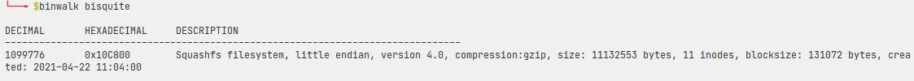

# Bisquite

## Description

May we have some [bisquite](bisquite)

## Files provided

An archive containing [bisquite](bisquite)

## Writeup

Running `binwalk` on the file we get the following result:



So there is a file system from address 1099776 that we probably can mount it. But first we should skip the first 1099776 bytes.

So we skip the first bytes and output it in a file called `out`, using `dd` command as below:

```
$ dd if=bisquite of=out skip=1099776 bs=1
```

And then we can mount `out`:

```
$ mkdir mnt
$ mount out mnt/
```

Now we can `cd` into `mnt` and see the flag in a `jps` image file.


## Flag

`S4CTF{r34LLy_L!k3_bisQu!73}`
